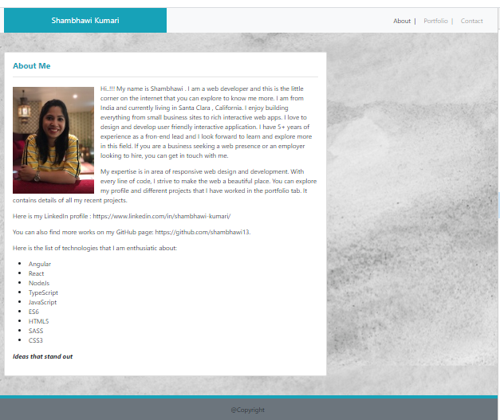
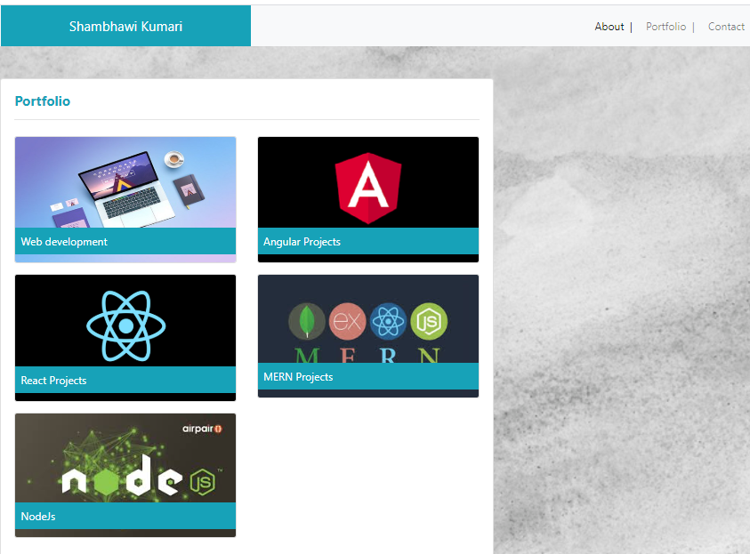
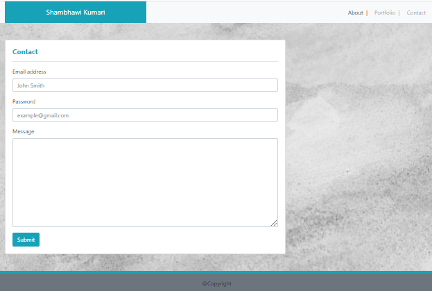

# responsive-portfolio

This website contains details of the author's portfolio. While navigating through the page, you might find three tabs :
- About : It contains information about the author (Shambhawi Kumari). You can also find the interest area and links to LinkedIn and GitHub
  

- Portfolio : This section displays the project work, the author has worked on.
 

- Contact : This section has contact detail.
 

## Prerequisites

```
git clone https://github.com/shambhawi13/responsive-portfolio.git
```

## Technologies Used
- HTML - used to create elements on the DOM
- CSS - styles html elements on page
- Bootstrap - responsive design and styling
- Git - version control system to track changes to source code
- GitHub - hosts repository that can be deployed to GitHub Pages

## Installing

- Clone the repository : git clone https://github.com/shambhawi13/html-git-css-homework.git
- Explore different opportunity provided by the website.


## Deployed Link

[Live Hosted on](https://shambhawi13.github.io/responsive-portfolio/)

## Authors

* **Shambhawi Kumari**
 [GitHub](https://github.com/shambhawi13/) | 
 [LinkedIn](https://www.linkedin.com/in/shambhawi-kumari/)


## Review URL

[GitHub](https://github.com/shambhawi13/responsive-portfolio/)
[Live](https://shambhawi13.github.io/responsive-portfolio/)


